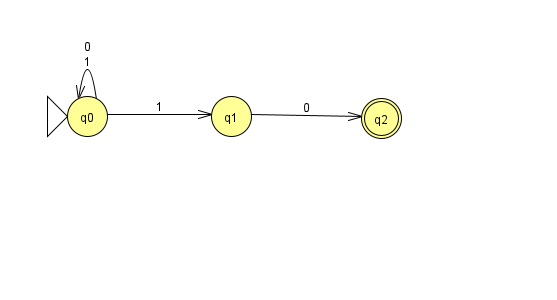
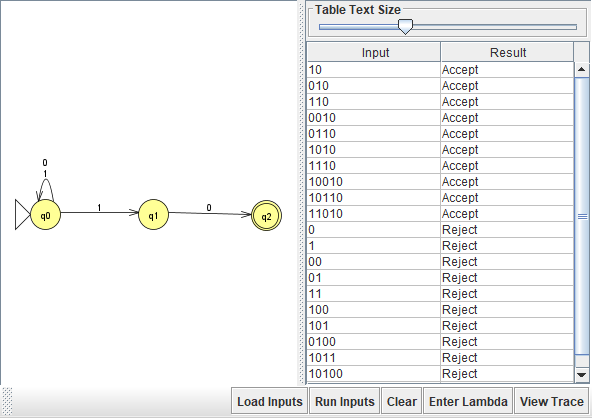
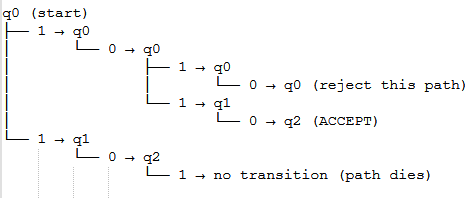
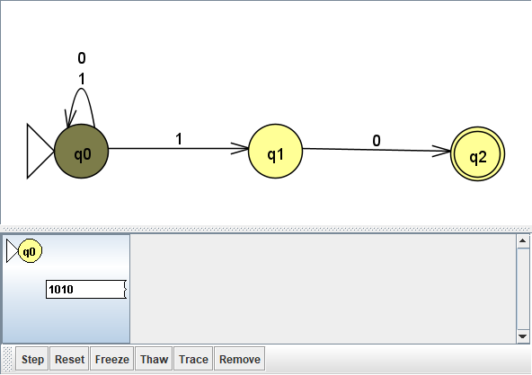
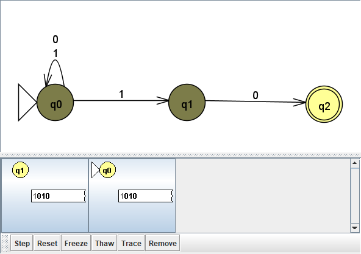
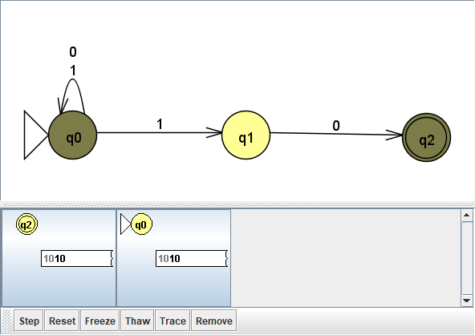
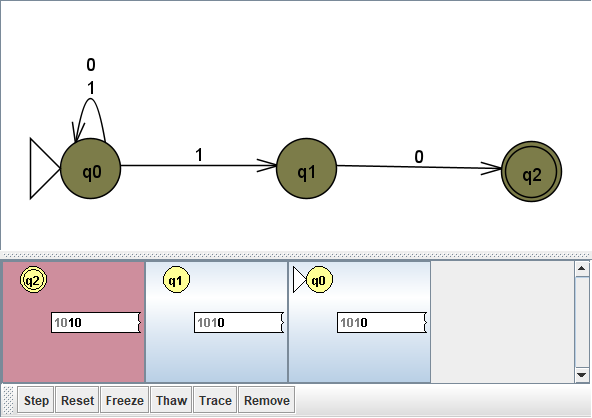
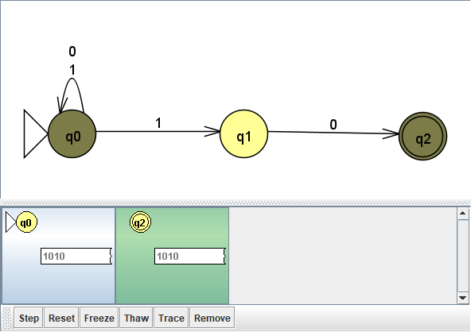
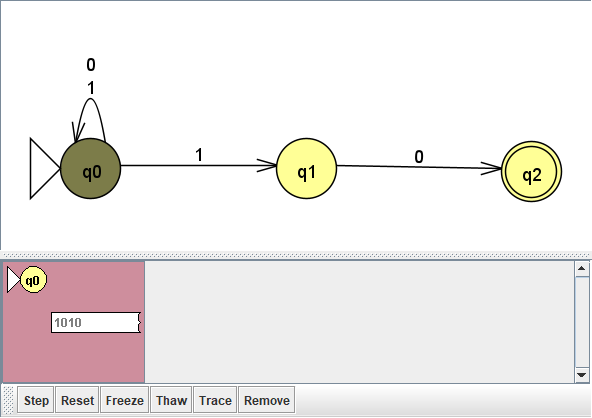

# Problem 7: Strings that end with 10

## My NFA

## Test results

## Tree computation

## Step-by-step trace
Test string: 1010

The string 1010 is accepted because at least one path consumes the entire string and ends in the accepting state q2.
