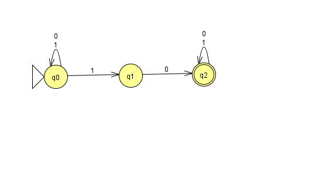
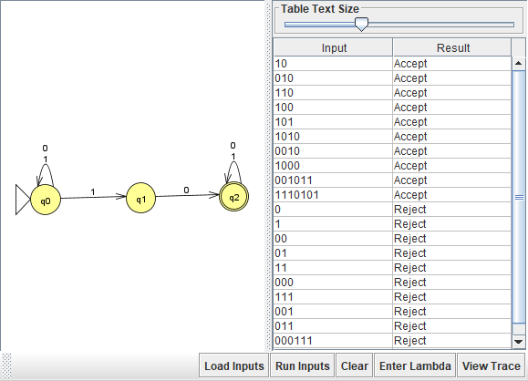
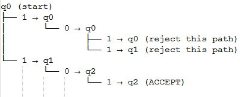
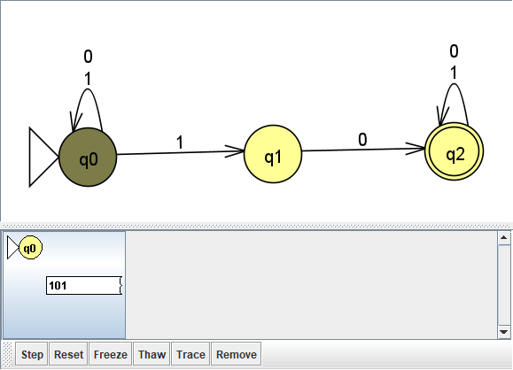
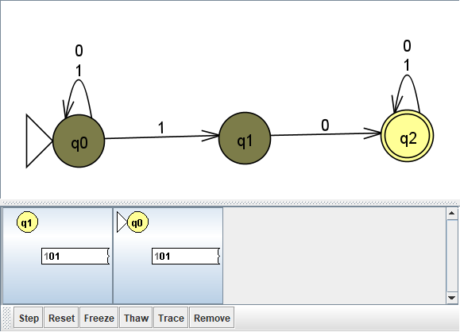
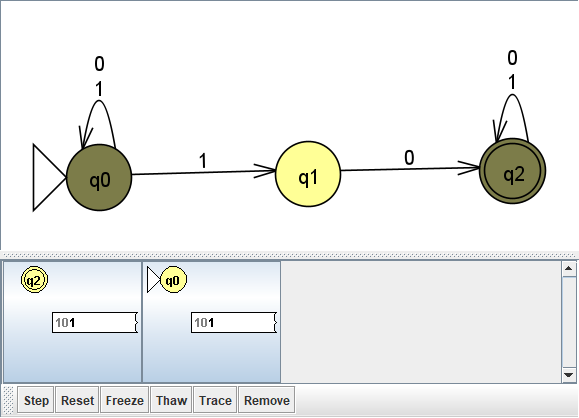
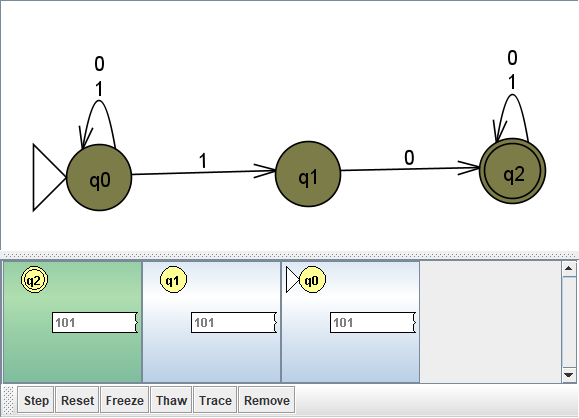
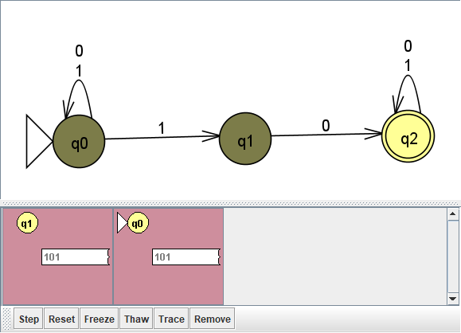

# Problem 9: Strings that contain 10

## My NFA

## Test results

## Tree computation

## Step-by-step trace
Test string: 101

The string 101 is accepted because it contains the substring 10. At least one path consumes the entire string and ends in the accepting state q2. The loop at q2 allows the final 1 to be read after matching 10.
